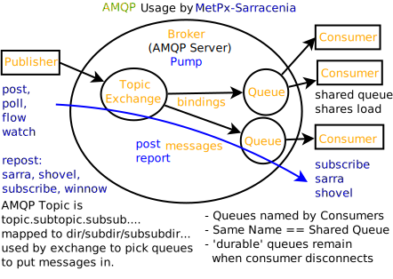

===========
Start Here
===========

This set of materials is hosted here: 

* https://github.com/MetPX/sr3-examples

Everything done in these examples should be reproducible by others.

Sarracenia in 10 minutes
------------------------

* Original "Project Scope" video, made in 2015 before the Sarracenia existed.

* The general idea: https://www.youtube.com/watch?v=G47DRwzwckk

* It was written before Sarracenia existed. It showed the plan.
  opportunities and deployments followed since then.

What Got Dropped
-----------------
 
* website moved: https://metpx.github.io/sarracenia
* have not had demand/use cases for: segmented files.

  * prioritization, to be re-implemented in time.

* have not deployed: logs/reports (easy to do in the app, but high volume.)

  * prioritization: easily re-implemented.

* cluster level routing: people want specific data sets, not all data from a cluster.

  * easily re-implemented.

* Edmonton site was dismantled (Project Alta)
* RADAR redundancy was implemented and then dismantled (S-Band only upload to Montreal)
    

What Stayed
-----------

* Pub/sub with urls, separate file transport (including third party.) 
* Daisy chain of servers to cross network barriers (placed near demarcation points)
* Flexible mass file transfers at high speed (parallelism with instances.)
* High Availability with checksums 

  * e.g. URP now winnows among six servers!
  * lots of issues with winnowing methods.

New Since The 2015 Video
------------------------

* *Sources*: groupings of data by originating org (replaced cluster routing.)
* *Trees* We're copying trees of files, not just files.
* Python *plugin API*, addresses initial inflexibilities.
* Sr3: Extensive python re-factor from 2020-2023.

  * 20% code size reduction
  * one algorithm for all components, and more commonality and consistency.
  * MQTT (another queueing protocol besides AMQP.)
  * different, more pythonic plugin architecture

* The C implementation exists and is integrated so both can be used together

  * subset (components: post,watch + shovel )
  * typically 10x lighter/faster than python, but no API.
  * the HPC mirroring use case. (not covered here.)

Future
------

* deployments of sr3 to operations (currently mirroring and external.)
* more thoughts about shared cluster (like HPC)
* working better in cloud environments.
* more/better training materials.
* improved CI/CD (reduced breakage on releases.)
* validating MQTT support
* re-enabling support for segmented files and reports

Sarracenia Components
----------------------

.. image:: Pictures/sr3_flow_example.svg

Vocabulary
-----------

