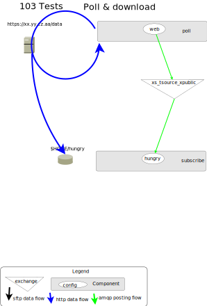

======================================
Sr3 103 Selecting Files for Processing
======================================

status: Outline

Downloading
-----------

Setup
~~~~~

1. create an empty ubuntu 22.04 VM. 

   * Follow the recipe from <README.rst> for create an empty data pump.
     https://github.com/MetPX/sr3-examples/tree/main/empty-amqp-pump

   * note the ip of the vm, and open a browser window on the management GUI (port 15672)
     the password for the bunnymaster user is in ~/.config/sr3/credentials.conf

2. copy the example configurations over:

   copy the configurations we need to the active ones::

    cd config/sr3
    for d in *; do
       mkdir -p ~/.config/sr3/$d
    done
    for cfg in */*; do
       cp ${cfg} ~/.config/sr3/${cfg}
       echo copied ${cfg}
    done

3. Declare the resources for local file post and subscription.

   an Overview of what we intend to configure:

   .. image:: Diagrams/sr3_103_a_Selection.svg

   ubuntu@flow2:~/sr3-examples/empty-amqp-pump$ **sr3 declare cpost/my_feed subscribe/hungry**

::

    declare: 2023-05-08 15:36:48,365 7791 [INFO] root declare looking at cpost/my_feed
    2023-05-08 15:36:48,379 7791 [INFO] sarracenia.moth.amqp __putSetup exchange declared: xs_tsource_public (as: amqp://tsource@localhost/)
    2023-05-08 15:36:48,380 7791 [INFO] root declare looking at subscribe/hungry
    2023-05-08 15:36:48,380 7791 [INFO] root declare looking at cpost/my_feed
    2023-05-08 15:36:48,380 7791 [INFO] root declare looking at subscribe/hungry
    2023-05-08 15:36:48,385 7791 [INFO] sarracenia.moth.amqp __getSetup queue declared q_tsub_subscribe.hungry.39945722.38576406 (as: amqp://tsub@localhost/)
    2023-05-08 15:36:48,385 7791 [INFO] sarracenia.moth.amqp __getSetup binding q_tsub_subscribe.hungry.39945722.38576406 with v03.# to xs_tsource_public (as: amqp://tsub@localhost/)

    ubuntu@flow2:~/sr3-examples/empty-amqp-pump$

4.  First pass, edit to get a reasonable root of the posting tree

    * edit the my_feed post_baseUrl to be more practical (longer one)
      (comment out the first one in the file, uncomment the second one.)

      ubuntu@flow2:~/sr3-examples/empty-amqp-pump$ **sr3 edit cpost/my_feed**

5. Post the files.

ubuntu@flow2:~/sr3-examples/empty-amqp-pump$ **sr3_cpost -c my_feed -p ~/sr3-examples/empty-amqp-pump/sample**

    ::

        2023-05-08 15:53:25,724 [NOTICE] logEvents option not implemented, ignored.
        2023-05-08 15:53:25,726 [INFO] cpost 3.23.05~ubuntu22.04.1 config: my_feed, pid: 8456, starting
        2023-05-08 15:53:25,726 [ERROR] posting outside of post_baseDir (/home/ubuntu/sr3-examples/empty-amqp-pump/sample/groceries) invalid path: /home/ubuntu/sr3-examples/empty-amqp-pump/sample
        2023-05-08 15:53:25,739 [INFO] published: { "pubTime":"20230508195325.72626993", "baseUrl":"file:/home/ubuntu/sr3-examples/empty-amqp-pump/sample/groceries", "relPath":"", "topic":"v03.post", "mtime":"20230508184339.48218706", "atime":"20230508194318.74930167", "mode":"0775", "fileOp" : { "directory":""}}
        2023-05-08 15:53:25,742 [INFO] published: { "pubTime":"20230508195325.73984278", "baseUrl":"file:/home/ubuntu/sr3-examples/empty-amqp-pump/sample/groceries", "relPath":"grains", "topic":"v03.post", "mtime":"20230508184339.48218706", "atime":"20230508194318.74930167", "mode":"0775", "fileOp" : { "directory":""}}
        2023-05-08 15:53:25,744 [INFO] published: { "pubTime":"20230508195325.74221365", "baseUrl":"file:/home/ubuntu/sr3-examples/empty-amqp-pump/sample/groceries", "relPath":"gr
        .
        .
        .

so because the declare was done above all of these files are now in the queue for the subscribe/hungry
configuration.  Looking at the management UI, Select the Queue tab, and then the queue itself 
within the tab, and then, looking down the list "get Message" and perhaps 5 as a quantity,
should give you a display similar to::

.. image: Pictures/sb103_messages_in_queue_screenshot.png

Note that, RabbitMQ does not use or understand the content of a message.
The messages are opaque binaries to RabbitMQ (or any AMQP broker.) 
Brokers use only the envelope information, or metadata of a message 
to do routing. Above each message in the display below is some metadata:

 * *Exchange*:  which exchange the message was published to in order to get into this queue.

 * *Routing Key*  With Sarracenia, all the exchanges used are *topic exchanges* so the *routing key* is a topic.

When sr3_cpost created the message, it assigned a topic header, by starting with the topic prefix (default: 'v03.post') 
and then appending the directories in the relative path of the message. Note that in AMQP, the topic separator
is a period, so the slashes are replaced by periods.

The messages are in one line, here is a version with a few line breaks for readability::

   { 
       "pubTime" : "20230508T195325.7449953", 
       "baseUrl" : "file:/home/ubuntu/sr3-examples/empty-amqp-pump/sample/groceries", 
       "relPath" : "grains/bread/whole_wheat", 
       "integrity" : {  
                "method" : "sha512", 
                "value" : "V5EVHm08ogoiJGYin3qlhpzWf6kssgqB7+KNkLd+QOibwQ8EQ5wcaRALZf1NDX/xZgAdsPRZ4mtLU2\nm6CHCQnw=="  
       },
       "source" : "tsource", 
       "size" : "3", 
       "atime" : "20230508T194318.74930167", 
       "mtime" : "20230508T184339.48218706", 
       "mode" : "664" 
   }

The path the subscriber will use to download is the concatenation of the *baseUrl* and and *relPath*
fields. In this message the relative path (from the "relPath" field) is "grains/bread/whole_wheat" ...  
 
* Topic will be: v03.post.grains.bread
* whole_wheat is the file name (only directories are in the topic)

the subscriber has no information about the topic in it. but the default topicPrefix is v03.post,
and the default subtopic is #.  # is a wildcard to any combination of topics, so the main binding
which can bee seen in the rabbitmq display is to:

   xs_tsource_public  v03.post.#

which essentially means every file posted by sr3_cpost. (> 80 of them.)

Using subtopic
~~~~~~~~~~~~~~

Topic filtering reduces the number of unwanted messages downloaded by a client
for Example:

   ubuntu@flow2:~/sr3-examples/empty-amqp-pump$ **sr3 stop subscribe/hungry**

      * stop the download subscription daemon.

   ubuntu@flow2:~/sr3-examples/empty-amqp-pump$ **sr3 cleanup subscribe/hungry**

      * discard the old queue contents, delete the old queue.

   ubuntu@flow2:~/sr3-examples/empty-amqp-pump$ **sr3 edit subscribe/hungry**

      * add a line *subtopic fruits.#* 

   so that the hungry subscription is only interested in getting fruits

   ubuntu@flow2:~/sr3-examples/empty-amqp-pump$ **sr3 declare subscribe/hungry**

      * create a new queue, with the new binding.  
      * can see the new biding in the management gui for the new queue.

   ubuntu@flow2:~/sr3-examples/empty-amqp-pump$ **sr3_cpost -c my_feed -p ~/sr3-examples/empty-amqp-pump/sample**

      * posting the files again.

Now examining the queue again, we see that far fewer files are queued for the subscriber (less than 30.)

This *server-side filtering*, is done by the broker itself, avoiding the transfer of messages between
broker and subscriber.  This is the most efficient means of filtering messages, however:

* one can only include topic to be included, there is no way to specify exclusions.
* the topic tree includes folder names, no filtering by file name is possible.

so when we start up the subscriber:

   ubuntu@flow2:~/sr3-examples/empty-amqp-pump$ **sr3 start subscribe/hungry**

::

   starting:.( 1 ) Done

   ubuntu@flow2:~/sr3-examples/empty-amqp-pump$ 

will then download only the fruits directory from the all the directories posted by cpost:

   ubuntu@flow2:~/sr3-examples/empty-amqp-pump$  **cd ~/hungry**

   ubuntu@flow2:~/hungry$ **find `pwd`**

::

    /home/ubuntu/hungry
    /home/ubuntu/hungry/fruits
    /home/ubuntu/hungry/fruits/mango.qty
    /home/ubuntu/hungry/fruits/oranges
    /home/ubuntu/hungry/fruits/oranges/valencia.qty
    /home/ubuntu/hungry/fruits/oranges/blood.jpg
    /home/ubuntu/hungry/fruits/oranges/cara_cara.jpg
    /home/ubuntu/hungry/fruits/oranges/clementine.qty
    /home/ubuntu/hungry/fruits/oranges/mandarins.jpg
    /home/ubuntu/hungry/fruits/oranges/clementines.jpg
    /home/ubuntu/hungry/fruits/oranges/mandarin.qty
    /home/ubuntu/hungry/fruits/oranges/cara_cara.qty
    /home/ubuntu/hungry/fruits/oranges/blood.qty
    /home/ubuntu/hungry/fruits/oranges/navel.qty
    /home/ubuntu/hungry/fruits/apples
    /home/ubuntu/hungry/fruits/apples/empire_qc.qty
    /home/ubuntu/hungry/fruits/apples/granny_smith.jpg
    /home/ubuntu/hungry/fruits/apples/empire.qty
    /home/ubuntu/hungry/fruits/apples/granny_smith.qty
    /home/ubuntu/hungry/fruits/apples/cortland.jpg
    /home/ubuntu/hungry/fruits/apples/macinthosh_qc.qty
    /home/ubuntu/hungry/fruits/apples/red_delicious.qty
    /home/ubuntu/hungry/fruits/bananas
    /home/ubuntu/hungry/fruits/bananas/cavendish.qty
    /home/ubuntu/hungry/fruits/bananas/plantain.qty
    /home/ubuntu/hungry/fruits/bananas/red_banana.qty
    /home/ubuntu/hungry/fruits/bananas/goldfinger.qty
    /home/ubuntu/hungry/fruits/bananas/pisang_raja_indonesia.qty
    /home/ubuntu/hungry/fruits/pears
    /home/ubuntu/hungry/fruits/pears/asian.qty
    /home/ubuntu/hungry/fruits/pears/yellow_snow.qty
    /home/ubuntu/hungry/fruits/pears/bartlett.qty
    ubuntu@flow2:~/hungry$

So these are the files available in the fruits directory.

* Most of these files are qty files.
* if we are only interested in the images, we should reject the qty files.

   ubuntu@flow2:~/hungry$ **rm -rf fruits**

   ubuntu@flow2:~/sr3-examples/empty-amqp-pump$ **sr3 stop subscribe/hungry**

      * stop the download subscription daemon.

   ubuntu@flow2:~/sr3-examples/empty-amqp-pump$ **sr3 edit subscribe/hungry**

      * add a line *reject .\*.qty*

   ubuntu@flow2:~/sr3-examples/empty-amqp-pump$ **sr3 cleanup subscribe/hungry**

      * discard the old queue contents, delete the old queue.

   ubuntu@flow2:~/hungry$ **sr3 declare subscribe/hungry** ::

     declare: 2023-05-08 17:50:28,196 13249 [INFO] root declare looking at subscribe/hungry
     2023-05-08 17:50:28,196 13249 [INFO] root declare looking at subscribe/hungry
     2023-05-08 17:50:28,212 13249 [INFO] sarracenia.moth.amqp __getSetup queue declared q_tsub_subscribe.hungry.34148622.02913293 (as: amqp://tsub@localhost/)
     2023-05-08 17:50:28,212 13249 [INFO] sarracenia.moth.amqp __getSetup binding q_tsub_subscribe.hungry.34148622.02913293 with v03.post.fruits.# to xs_tsource_public (as: amqp://tsub@localhost/)

   ubuntu@flow2:~/sr3-examples/empty-amqp-pump$ **sr3_cpost -c my_feed -p ~/sr3-examples/empty-amqp-pump/sample**
   
      * post the files again.

   If we now consult the management GUI, we shoould see on the order of 20 files in the queue.
   like before.  If we then:

   ubuntu@flow2:~/sr3-examples/empty-amqp-pump$ **sr3 start subscribe/hungry**

      * start the download subscription daemon, with the new reject line.

   ubuntu@flow2:~/hungry$ find `pwd`
   /home/ubuntu/hungry
   /home/ubuntu/hungry/fruits
   /home/ubuntu/hungry/fruits/oranges
   /home/ubuntu/hungry/fruits/oranges/blood.jpg
   /home/ubuntu/hungry/fruits/oranges/cara_cara.jpg
   /home/ubuntu/hungry/fruits/oranges/mandarins.jpg
   /home/ubuntu/hungry/fruits/oranges/clementines.jpg
   /home/ubuntu/hungry/fruits/apples
   /home/ubuntu/hungry/fruits/apples/granny_smith.jpg
   /home/ubuntu/hungry/fruits/apples/cortland.jpg
   /home/ubuntu/hungry/fruits/bananas
   /home/ubuntu/hungry/fruits/pears
   ubuntu@flow2:~/hungry$ 

So now we see that while there were >20 files queued on the broker, the subscriber only copied a handful of files,
the ones that were not rejected.

Accept/Reject Clauses
~~~~~~~~~~~~~~~~~~~~~

* Apply additional filtering to include or exclude files from the set to be transferred

* work with full regular expressions, not just globbing or string matching.

* Rather than being evaluated on the broker, done on the client (inside sarracenia programes.)
  messages are downloaded prior to evaluation, but the files data is not (yet) transferred

* The accept/reject clauses work on the full URL, that is, in this case, they would have see paths like:

       file:/home/ubuntu/sr3-examples/empty-amqp-pump/sample/groceries/fruits/apples/cortland.jpg

* are the main part of the *filter* in the sarracenia algorithm, that is part of the flow of each
  sarracenia sr_subscribe process, 
  
* if a file is accepted, processing continues, and the corresponding file gets transferred.

Multiple Directories 
~~~~~~~~~~~~~~~~~~~~

The configuration file is read from top to bottom, and some options can appear multiple
times. If there are multiple *accept* and *reject* clauses, know that the first one
to match the input URL will be actioned.

The *directory* clause sets the root of stuff to be download, *for accept clauses that follow 
it in the file* (or the end of file if there are none.) The mirror option works has the 
same scope, affecting files accepted later in the file.

 if we edit web_hungry to look like this ::

    broker amqp://tsub@localhost

    exchange xs_tsource_public

    topicPrefix v03.post
    subtopic fruits.#
    subtopic vegetables.#

    # print log messages for every file rejected.
    logReject on

    # make directories to match the source.
    mirror off

    reject .*\.qty

    # root of the directory where files will be placed.

    directory ${HOME}/hungry/fruits
    accept .*fruits.*

    mirror on
    directory ${HOME}/hungry/

We have turned off mirroring, and now want both fruits and vegetables in their
own directories.

We can demonstrate that with another round:

   ubuntu@flow2:~/hungry$ **rm -rf fruits**

   ubuntu@flow2:~/sr3-examples/empty-amqp-pump$ **sr3 stop subscribe/hungry**

      * stop the download subscription daemon.

   ubuntu@flow2:~/sr3-examples/empty-amqp-pump$ **sr3 edit subscribe/hungry**

      * as illustrated above:
      * add line "subtopic vegetables.#
      * change mirror off
      * add line "directory ${HOME}/hungry/fruits 
      * add line "accept .*/fruits/.*
      * add line mirror on

   ubuntu@flow2:~/sr3-examples/empty-amqp-pump$ **sr3 cleanup subscribe/hungry**

      * discard the old queue contents, delete the old queue.

   ubuntu@flow2:~/hungry$ **sr3 declare subscribe/hungry** ::

     declare: 2023-05-09 08:10:31,448 48412 [INFO] root declare looking at subscribe/hungry
     2023-05-09 08:10:31,448 48412 [INFO] root declare looking at subscribe/hungry
     2023-05-09 08:10:31,462 48412 [INFO] sarracenia.moth.amqp __getSetup queue declared q_tsub_subscribe.hungry.49018002.48697803 (as: amqp://tsub@localhost/)
     2023-05-09 08:10:31,462 48412 [INFO] sarracenia.moth.amqp __getSetup binding q_tsub_subscribe.hungry.49018002.48697803 with v03.post.fruits.# to xs_tsource_public (as: amqp://tsub@localhost/)
     2023-05-09 08:10:31,465 48412 [INFO] sarracenia.moth.amqp __getSetup binding q_tsub_subscribe.hungry.49018002.48697803 with v03.post.vegetables.# to xs_tsource_public (as: amqp://tsub@localhost/)

the we post and subscribe

   ubuntu@flow2:~/sr3-examples/empty-amqp-pump$ **sr3_cpost -c my_feed -p ~/sr3-examples/empty-amqp-pump/sample**
   
      * post the files again.

   ubuntu@flow2:~/sr3-examples/empty-amqp-pump$ **sr3 start subscribe/hungry**

      * start the download subscription daemon, with the new reject line.

   ubuntu@flow2:~/hungry$ find `pwd` ::

     /home/ubuntu/hungry
     /home/ubuntu/hungry/vegetables
     /home/ubuntu/hungry/vegetables/brussel_sprouts.qty
     /home/ubuntu/hungry/vegetables/boston_lettuce.qty
     /home/ubuntu/hungry/vegetables/tomatoes.qty
     /home/ubuntu/hungry/vegetables/roots
     /home/ubuntu/hungry/vegetables/roots/garlic.qty
     /home/ubuntu/hungry/vegetables/roots/chives.qty
     /home/ubuntu/hungry/vegetables/roots/potatoes
     /home/ubuntu/hungry/vegetables/roots/potatoes/idaho_red.qty
     /home/ubuntu/hungry/vegetables/roots/potatoes/cavendish.qty
     /home/ubuntu/hungry/vegetables/roots/potatoes/irish.qty
     /home/ubuntu/hungry/vegetables/roots/potatoes/sweet.qty
     /home/ubuntu/hungry/vegetables/roots/carrots.qty
     /home/ubuntu/hungry/vegetables/roots/onions.jpg
     /home/ubuntu/hungry/vegetables/roots/onions.qty
     /home/ubuntu/hungry/vegetables/roots/shallots.jpg
     /home/ubuntu/hungry/vegetables/roots/potatoes.qty
     /home/ubuntu/hungry/vegetables/roots/shallots.qty
     /home/ubuntu/hungry/vegetables/broccoli.qty
     /home/ubuntu/hungry/vegetables/spinach.qty
     /home/ubuntu/hungry/fruits
     /home/ubuntu/hungry/fruits/valencia.qty
     /home/ubuntu/hungry/fruits/cavendish.qty
     /home/ubuntu/hungry/fruits/plantain.qty
     /home/ubuntu/hungry/fruits/asian.qty
     /home/ubuntu/hungry/fruits/empire_qc.qty
     /home/ubuntu/hungry/fruits/yellow_snow.qty
     /home/ubuntu/hungry/fruits/blood.jpg
     /home/ubuntu/hungry/fruits/cara_cara.jpg
     /home/ubuntu/hungry/fruits/red_banana.qty
     /home/ubuntu/hungry/fruits/clementine.qty
     /home/ubuntu/hungry/fruits/mandarins.jpg
     /home/ubuntu/hungry/fruits/clementines.jpg
     /home/ubuntu/hungry/fruits/bartlett.qty
     /home/ubuntu/hungry/fruits/granny_smith.jpg
     /home/ubuntu/hungry/fruits/mango.qty
     /home/ubuntu/hungry/fruits/empire.qty
     /home/ubuntu/hungry/fruits/granny_smith.qty
     /home/ubuntu/hungry/fruits/mandarin.qty
     /home/ubuntu/hungry/fruits/cortland.jpg
     /home/ubuntu/hungry/fruits/oranges
     /home/ubuntu/hungry/fruits/apples
     /home/ubuntu/hungry/fruits/cara_cara.qty
     /home/ubuntu/hungry/fruits/macinthosh_qc.qty
     /home/ubuntu/hungry/fruits/blood.qty
     /home/ubuntu/hungry/fruits/goldfinger.qty
     /home/ubuntu/hungry/fruits/red_delicious.qty
     /home/ubuntu/hungry/fruits/bananas
     /home/ubuntu/hungry/fruits/pisang_raja_indonesia.qty
     /home/ubuntu/hungry/fruits/navel.qty
     /home/ubuntu/hungry/fruits/pears
     ubuntu@flow:~/hungry$ 

Notes:

  * topics are server side, so they are applied first (order has no effect)

  * accept is processed apply client-side, and the first match wins.

  * Because of *mirror off* for the fruits, they are no longer in sub-directories like 
    oranges, pears, apples, bananas.

One can see that, while the fruits are all in the single fruit directory (because mirror off) the vegetables,
are still in multiple ones (mirror on.)
    

Uploading/Noticing
------------------

There are many different ways to create download messages to start files circulating in a Sarracenia
network.

   * sr3_cpost - post a file, or watch a directory (C-binary)
   * sr3_post - post a file (python script.)
   * sr3_watch - watch a directory (python)
   * sr3_poll - poll a remote directory or web resource. 
   * sr3 flow - for doing weird things.

userdir/sr_cpost
~~~~~~~~~~~~~~~~

So far, we have used sr3_cpost, a one-shot binary to post messages about file given on the
command line. One can also use the same binary as a service daemon to watch a directory by adding the *sleep* 
directive.

  ubuntu@flow2:~/sr3-examples/empty-amqp-pump$ **sr3 edit cpost/my_feed** ::

    post_broker amqp://tsource@localhost
    post_exchange xs_tsource_public
    #post_baseUrl file:/

    # for later...
    #post_baseUrl file:${HOME}/sr3-examples/empty-amqp-pump/sample/groceries
    #
    sleep 5
    path ${HOME}/public_html
    post_baseUrl http://localhost/~${USER}
    post_baseDir ${HOME}/public_html

Now have:

  * added *sleep 5* which means it should sleep for at most 5 seconds before noticing a file.  
  * We moved the -p argument into the configuration file as the *path* and it is going to monitor the ${HOME}/feed directory.  
  * changed post_baseUrl to be appropriate for the new location.

  ubuntu@flow2:~/sr3-examples/empty-amqp-pump$ **sr3 edit cpost/my_feed** 

    * comment out the old post_baseUrl
    * add new line: sleep 5
    * add new line: path ${HOME}/public_html
    * add new line: post_baseUrl http://localhost/~${USER}
    * add new line: post_baseDir ${HOME}/public_html

  ubuntu@flow2:~/sr3-examples/empty-amqp-pump$ **sudo apt install apache2**

   * ensure apache is installed. (if not done before.)

  ubuntu@flow2:~/sr3-examples/empty-amqp-pump$ **sudo a2enmod userdir** ::

     Enabling module userdir.
     To activate the new configuration, you need to run:
       systemctl restart apache2

  ubuntu@flow2:~/sr3-examples/empty-amqp-pump$ **sudo systemctl restart apache2**

     * activate userdir support in apache.

  ubuntu@flow2:~/sr3-examples/empty-amqp-pump$ **mkdir ~/public_html ~/web_hungry**

     * make a userdir for posting, 
     * make web_hungry for a downloading subscriber.

  ubuntu@flow2:~/sr3-examples/empty-amqp-pump$ **chmod +x ~ ~/public_html**

     * allow apache daemon read access to userdir ( aka ~/public_html )

  ubuntu@flow2:~/sr3-examples/empty-amqp-pump$  **sr3 start cpost/my_feed subscribe/web_hungry**

  ubuntu@flow2:~/sr3-examples/empty-amqp-pump$  **cd ~/public_html**
  
  ubuntu@flow2:~/sr3-examples/empty-amqp-pump$  **echo hello >1stFile**

  ubuntu@flow2:~/sr3-examples/empty-amqp-pump$  **echo bonjour >2ndFile**

  ubuntu@flow2:~/sr3-examples/empty-amqp-pump$  **echo hola >3rdFile**

  ubuntu@flow2:~/sr3-examples/empty-amqp-pump$  **echo GutenMorgen >4thFile**

  ubuntu@flow2:~/sr3-examples/empty-amqp-pump$  **ls ~/web_hungry** ::

    ubuntu@flow:~/.cache/sr3/log$ ls -al ~/web_hungry
    total 40
    drwxrwxr-x  2 ubuntu ubuntu 4096 May  9 15:57 .
    drwxr-x--x 12 ubuntu ubuntu 4096 May  9 15:33 ..
    -rw-rw-r--  1 ubuntu ubuntu    6 May  9 15:35 1stFile
    -rw-rw-r--  1 ubuntu ubuntu    8 May  9 15:35 2ndFile
    -rw-rw-r--  1 ubuntu ubuntu    5 May  9 15:35 3rdFile
    -rw-rw-r--  1 ubuntu ubuntu   12 May  9 15:35 4thFile
    ubuntu@flow:~/.cache/sr3/log$ 

We can see that the file was made available in ~/publc_html and was copied to ~/web_hungry.

Note that to watch directories:

   * watch is the python implementation of cpost, uses the same configuration files
     but has more features and plugin support.
   * The *force_polling* flag is needed on cluster file systems, is much less efficient.
   * There are different methods available for different volumes of files:
     https://metpx.github.io/sarracenia/Explanation/DetectFileReady.html

Polling a Web Site
~~~~~~~~~~~~~~~~~~

Most sites are not Sarracenia enabled, meaning they don't produce messages for each file they
publish. They will produce a directory or a query API of some kind, and one must issue
queries of a directory listing to learn which new files are available.
To get messages created, so that subscribers can start downloading their files,
we can use sr_poll.

From sr3_102, we have content in /var/www/html/data.

  ubuntu@flow:~/.cache/sr3/log$ **mkdir ~/.config/sr3/poll**
  
  ubuntu@flow:~/.cache/sr3/log$ **cp ~/.config/sr3/cpost/my_feed.conf ~/.config/sr3/poll/web.conf**

  ubuntu@flow:~/.cache/sr3/log$ **sr3 edit poll/web** ::

    post_broker amqp://tsource@localhost
    post_exchange xs_tsource_public

    sleep 5

    pollUrl http://10.110.41.87

    path data

    post_baseUrl http://10.110.41.87

Every 5 seconds, send an http query to ip address 10.110.41.87, and issue a "GET /data" request.
The response expected is a list of files (in HTML) use the python standard HTML parser to 
extract the file information, and create messages from it to retrieve the corresponding files.

We can use the original subscriber/hungry to download from this poll.  

  ubuntu@flow:~/.cache/sr3/log$ **sr3 edit subscribe/hungry** ::

    broker amqp://tsub@localhost

    exchange xs_tsource_public

    subtopic #

    # print log messages for every file rejected.
    logReject on

    # make directories to match the source.
    mirror

    # root of the directory where files will be placed.
    directory ${HOME}/hungry

removing topics because the new files won't be in the same folders.

make some data ::

    cd /var/www/html/data
    rm -rf *
    mkdir pigs chickens cats dogs
    echo '1' >pigs/toto
    echo one >dogs/fido
    echo two >dogs/lassie
    echo etwtr >dogs/spot
    echo miaou >cats/felix
    echo how >cats/sylvester
    echo chow >cats/garfield

then we can start things up:
 
  ubuntu@flow:~/.cache/sr3/log$ **sr3 stop poll/web subscribe/hungry** ::

      Stopping: no procs running...already stopped

  ubuntu@flow:~/.cache/sr3/log$ **sr3 --dangerWillRobinson cleanup poll/web subscribe/hungry** ::

      cleanup: 2023-05-10 16:36:52,577 24026 [INFO] sarracenia.moth.amqp getCleanUp deleteing queue q_tsub_subscribe.hungry.91587237.27237369
     remove q_tsub_subscribe.hungry.91587237.27237369 from xs_tsource_public subscribers: ['q_tsub_sarra.web_feed.82439790.80718169', 'q_tsub_subscribe.hungry.91587237.27237369']
     removing state file: /home/ubuntu/.cache/sr3/subscribe/hungry/subscribe_hungry_00.metrics
     removing state file: /home/ubuntu/.cache/sr3/subscribe/hungry/subscribe.hungry.tsub.qname

  ubuntu@flow:~/.cache/sr3/log$ **sr3 declare poll/web subscribe/hungry** ::

      declare: 2023-05-10 16:37:22,938 24061 [INFO] root declare looking at poll/web
      2023-05-10 16:37:22,941 24061 [INFO] sarracenia.moth.amqp __putSetup exchange declared: xs_tsource_public (as: amqp://tsource@localhost/)
      2023-05-10 16:37:22,942 24061 [INFO] root declare looking at subscribe/hungry
      2023-05-10 16:37:22,942 24061 [INFO] root declare looking at poll/web
      2023-05-10 16:37:22,942 24061 [INFO] root declare looking at subscribe/hungry
      2023-05-10 16:37:22,947 24061 [INFO] sarracenia.moth.amqp __getSetup queue declared q_tsub_subscribe.hungry.20777263.97761082 (as: amqp://tsub@localhost/)
      2023-05-10 16:37:22,947 24061 [INFO] sarracenia.moth.amqp __getSetup binding q_tsub_subscribe.hungry.20777263.97761082 with v03.# to xs_tsource_public (as: amqp://tsub@localhost/)

  ubuntu@flow:~/.cache/sr3/log$ **sr3 start poll/web subscribe/hungry** ::

      starting:.( 2 ) Done

  ubuntu@flow:~/.cache/sr3/log$ **find ~/hungry** ::

      /home/ubuntu/hungry
      /home/ubuntu/hungry/data
      /home/ubuntu/hungry/data/pigs
      /home/ubuntu/hungry/data/pigs/toto
      /home/ubuntu/hungry/data/cats
      /home/ubuntu/hungry/data/cats/sylvester
      /home/ubuntu/hungry/data/cats/felix
      /home/ubuntu/hungry/data/cats/garfield
      /home/ubuntu/hungry/data/dogs
      /home/ubuntu/hungry/data/dogs/fido
      /home/ubuntu/hungry/data/dogs/spot
      /home/ubuntu/hungry/data/dogs/lassie
      /home/ubuntu/hungry/data/chickens

  ubuntu@flow:~/.cache/sr3/log$ 

Scheduled Polls
---------------

Sometimes the API provided by a remote source is such that you just issue the 
same query over and over again, rather than obtaining a list of new products.

A *flow* component has no built-in behaviour. Any other component's behaviour can be built
from a flow, just by adding settings and callbacks. 

get other things out of the way:

  ubuntu@flow:~/.cache/sr3/log$ **sr3 stop** 

  ubuntu@flow:~/.cache/sr3/log$ **sr3 edit flow/scheduled_noaa_tsunami** ::

      post_broker amqp://tfeed@localhost/
      post_exchange xs_NOAA-TSUNAMI_public

      #FIXME short interval for testing.
      scheduled_interval 10
      #scheduled_interval 60

      nodupe_ttl false

      logEvents all
      logMessageDump on

      callback scheduled

      callback post.message

      post_baseUrl https://www.tsunami.gov/events/xml/

      path PAAQAtom.xml

      path PHEBAtom.xml

  edit:

    * Use the shorter scheduled_interval ... *scheduled_interval 10* (seconds)
    * nodupe_ttl false, because the content will change every time we poll
    * *callback scheduled* is plugin to create messages on a schedule.
    * *clalback post.message* is a plugin to post the messsages created

  ubuntu@flow:~/.cache/sr3/log$ **mkdir ~/tsunami**

  ubuntu@flow:~/.cache/sr3/log$ **sr3 cleanup subscribe/tsunami** ::
      cleanup: 2023-05-11 08:32:06,189 63614 [INFO] sarracenia.moth.amqp getCleanUp deleteing queue q_tsub_subscribe.tsunami.20777263.97761082
      remove q_tsub_subscribe.tsunami.20777263.97761082 from xs_tsource_public subscribers: ['q_tsub_sarra.web_feed.82439790.80718169', 'q_tsub_subscribe.tsunami.20777263.97761082'] 
      removing state file: /home/ubuntu/.cache/sr3/subscribe/tsunami/subscribe.tsunami.tsub.qname
      removing state file: /home/ubuntu/.cache/sr3/subscribe/tsunami/subscribe_tsunami_01.metrics

  ubuntu@flow:~/.cache/sr3/log$ **sr3 declare flow/scheduled_noaa_tsunami subscribe/tsunami**  ::
  
      declare: 2023-05-11 08:43:08,228 64091 [INFO] root declare looking at flow/scheduled_noaa_tsunami
      2023-05-11 08:43:08,243 64091 [INFO] sarracenia.moth.amqp __putSetup exchange declared: xs_NOAA-TSUNAMI_public (as: amqp://tfeed@localhost/)
      2023-05-11 08:43:08,244 64091 [INFO] root declare looking at subscribe/tsunami
      2023-05-11 08:43:08,244 64091 [INFO] root declare looking at flow/scheduled_noaa_tsunami
      2023-05-11 08:43:08,244 64091 [INFO] root declare looking at subscribe/tsunami
      2023-05-11 08:43:08,246 64091 [INFO] sarracenia.moth.amqp __getSetup queue declared q_tsub_subscribe.tsunami.78732907.90128907 (as: amqp://tsub@localhost/)
      2023-05-11 08:43:08,246 64091 [INFO] sarracenia.moth.amqp __getSetup binding q_tsub_subscribe.tsunami.78732907.90128907 with v03.# to xs_NOAA-TSUNAMI_public (as: amqp://tsub@localhost/)

  ubuntu@flow:~/.cache/sr3/log$ **sr3 start flow/scheduled_noaa_tsunami subscribe/tsunami**
      Starting:.( 2 ) Done

  ubuntu@flow:~/.cache/sr3/log$ **ls ~/tsunami** ::

      -rw-rw-r--  1 ubuntu ubuntu 1983 May 12 08:44 PAAQAtom.xml
      -rw-rw-r--  1 ubuntu ubuntu 1945 May 12 08:44 PHEBAtom.xml

  ubuntu@flow:~/.cache/sr3/log$
  
This file is being downloaded and overwritten every 10 seconds. To make the downloads
more visible, one prepend a date stamp to it.

  ubuntu@flow:~/.cache/sr3/log$ **sr3 edit flow/scheduled_noaa_tsunami subscribe/tsunami**

     * remote the # before *callback prepend_datetime* to activate that plugin

Let's take a look at this new callback. There are a number of callbacks included with Sarracenia,
but custom ones can be added in the ~/.config/sr3/plugins directory. This directory is added
to PYTHONPATH (the module search path in python) and imported as any other python module.

   ubuntu@flow:~/.cache/sr3/log$ **vi ~/.config/sr3/plugins/prepend_datetimestamp.py** ::

      import datetime
      import logging
      import paramiko
      import re
      import sarracenia
      from sarracenia.flowcb import FlowCB
      import time
      from urllib.parse import urlparse

      logger = logging.getLogger(__name__)

      class Prepend_datetimestamp(FlowCB):

          def after_accept(self, worklist):

              for m in worklist.incoming:
                  file_name = m['new_file']
                  yyyymmddHHMMSS = time.strftime("%Y%m%d%H%M%S", time.gmtime())
                  m['new_file'] = yyyymmddHHMMSS + '_' + file_name

Callbacks are python classes which have well-known entry points.  In this example,
the *after_accept* entry point is used, which is called after all accept/reject 
options have been evaluated. The routing takes the worklist as a parameter.
The rejected messages are in *worklist.rejected*, and the accepted ones are 
in *worklist.incoming.*

worklist.incoming is a list of messages, each of which is a python dictionary.
There fields in the dictionaries are the headers in the messages.  To change
the name of the file downloaded, for example, modify *m['new_file']*

notes:

  * main class documentation: https://metpx.github.io/sarracenia/Reference/flowcb.html#module-sarracenia.flowcb
  * Sarracenia Plugin/Programming Guide: https://metpx.github.io/sarracenia/Explanation/SarraPluginDev.html

  ubuntu@flow:~/.cache/sr3/log$ **sr3 restart subscribe/tsunami** ::

      stopping: sending SIGTERM  ( 0 ) Done
      Waiting 1 sec. to check if 1 processes stopped (try: 0)
      All stopped after try 0
      starting: .( 1 ) Done

      
  ubuntu@flow:~/.cache/sr3/log$ **ls -al ~/tsunami** ::

      total 136
      drwxrwxr-x  2 ubuntu ubuntu 4096 May 12 08:47 .
      drwxr-x--x 12 ubuntu ubuntu 4096 May 12 08:45 ..
      -rw-rw-r--  1 ubuntu ubuntu 1983 May 12 08:45 20230512124539_PAAQAtom.xml
      -rw-rw-r--  1 ubuntu ubuntu 1945 May 12 08:45 20230512124539_PHEBAtom.xml
      -rw-rw-r--  1 ubuntu ubuntu 1983 May 12 08:45 20230512124549_PAAQAtom.xml
      -rw-rw-r--  1 ubuntu ubuntu 1945 May 12 08:45 20230512124549_PHEBAtom.xml
      -rw-rw-r--  1 ubuntu ubuntu 1983 May 12 08:45 20230512124557_PAAQAtom.xml
      -rw-rw-r--  1 ubuntu ubuntu 1945 May 12 08:45 20230512124557_PHEBAtom.xml
      -rw-rw-r--  1 ubuntu ubuntu 1983 May 12 08:46 20230512124606_PAAQAtom.xml
      -rw-rw-r--  1 ubuntu ubuntu 1945 May 12 08:46 20230512124606_PHEBAtom.xml
      -rw-rw-r--  1 ubuntu ubuntu 1983 May 12 08:46 20230512124617_PAAQAtom.xml
      -rw-rw-r--  1 ubuntu ubuntu 1945 May 12 08:46 20230512124617_PHEBAtom.xml
      -rw-rw-r--  1 ubuntu ubuntu 1983 May 12 08:46 20230512124625_PAAQAtom.xml
      -rw-rw-r--  1 ubuntu ubuntu 1945 May 12 08:46 20230512124625_PHEBAtom.xml
      -rw-rw-r--  1 ubuntu ubuntu 1983 May 12 08:46 20230512124636_PAAQAtom.xml
      -rw-rw-r--  1 ubuntu ubuntu 1945 May 12 08:46 20230512124636_PHEBAtom.xml
      -rw-rw-r--  1 ubuntu ubuntu 1983 May 12 08:46 20230512124646_PAAQAtom.xml
      -rw-rw-r--  1 ubuntu ubuntu 1945 May 12 08:46 20230512124646_PHEBAtom.xml
      -rw-rw-r--  1 ubuntu ubuntu 1983 May 12 08:46 20230512124656_PAAQAtom.xml
      -rw-rw-r--  1 ubuntu ubuntu 1945 May 12 08:46 20230512124656_PHEBAtom.xml
      -rw-rw-r--  1 ubuntu ubuntu 1983 May 12 08:47 20230512124707_PAAQAtom.xml
      -rw-rw-r--  1 ubuntu ubuntu 1945 May 12 08:47 20230512124707_PHEBAtom.xml
      -rw-rw-r--  1 ubuntu ubuntu 1983 May 12 08:47 20230512124716_PAAQAtom.xml
      -rw-rw-r--  1 ubuntu ubuntu 1945 May 12 08:47 20230512124716_PHEBAtom.xml
      -rw-rw-r--  1 ubuntu ubuntu 1983 May 12 08:47 20230512124727_PAAQAtom.xml
      -rw-rw-r--  1 ubuntu ubuntu 1945 May 12 08:47 20230512124727_PHEBAtom.xml
      -rw-rw-r--  1 ubuntu ubuntu 1983 May 12 08:47 20230512124735_PAAQAtom.xml
      -rw-rw-r--  1 ubuntu ubuntu 1945 May 12 08:47 20230512124735_PHEBAtom.xml
      -rw-rw-r--  1 ubuntu ubuntu 1983 May 12 08:47 20230512124746_PAAQAtom.xml
      -rw-rw-r--  1 ubuntu ubuntu 1945 May 12 08:47 20230512124746_PHEBAtom.xml
      -rw-rw-r--  1 ubuntu ubuntu 1983 May 12 08:47 20230512124757_PAAQAtom.xml
      -rw-rw-r--  1 ubuntu ubuntu 1945 May 12 08:47 20230512124757_PHEBAtom.xml
      -rw-rw-r--  1 ubuntu ubuntu 1983 May 12 08:44 PAAQAtom.xml
      -rw-rw-r--  1 ubuntu ubuntu 1945 May 12 08:44 PHEBAtom.xml

  ubuntu@flow:~/.cache/sr3/log$

About Atom Feeds
----------------

This example demonstrates a disadvantage of Atom feeds when compared with pub/sub methods.
From this we can calculate the load of keeping up with an Atom (aka RSS) feed with a 10 second 
frequency, 3928 bytes (the two files) multiply 8 to get bits and divide by 10 for a per second rate, 
we get:

   * 3228*8/10/1024 = 2.5 kbits/second.

Note that all of the files are the same, because there is no change in the warning status.
so that means we are transferring:

   * 2.5 kbps * 60 * 60 * 24 / 1024 / 8 = 26 megabytes / day

to know that there are no warnings (which is the usual case, as tsunamis are fairly infrequent.)  
If the time sensitivity goes up (poling every second) then the overhead increases exponentially
(It is 10x more transfer for a 10x increase in polling frequency.)

Note that in the data pump case, we are often not dealing with only a single download case, but 
rather downloading on behalf of and entire group of servers or an entire organization.

This traffic needs to be forwarded to every consumer of the message, so if we need to distribute the data
to ten clients (which is a reasonable real-world value for us), then the traffic to distribute
this information is ten-fold the calculation above.

Review
------

1. in a configuration file:

 * *topicPrefix* used to select message format (many pumps use v02.post)
 * *subtopic* is used to add **server-side filtering** narrowing down the messages which are
   queued for a subscriber.
 * *directory* defines the root directory of the tree where files are written.
 * *accept/reject* accept regular expressions that are matched against the download URL.
 * multiple *directory + accept* lines in the configuration files can put different products
   in different directories

2. There are many ways to create a post for a file:

There are different methods available for different volumes of files. A view of some different
options is here:

     https://metpx.github.io/sarracenia/Explanation/DetectFileReady.html

briefly:

 * sr3_cpost (sleep=0 or foreground) and sr3_post one shot commands to post files.

 * sr3_cpost (sleep > 0 ) or sr3 watch to service daemons to watch trees and post files that show up.

 * sr3 poll ... query a remote system for new items available to download into files.

 * sr3 flow ... roll your own way to notice things to post.

    * flowcb.scheduled ... to make messages so subscribers can download the same url over and over.

There is another last posting method left to later (shim) ;-)

3. There is a python plugin api.

  * plugins are python classes in python module files, imported with normal python mechanisms.
  * main class documentation: https://metpx.github.io/sarracenia/Reference/flowcb.html#module-sarracenia.flowcb
  * Sarracenia Plugin/Programming Guide: https://metpx.github.io/sarracenia/Explanation/SarraPluginDev.html
  * plugins are activated with the *callback* option in the configuration file.
  * ~/.config/sr3/plugins is added to PYTHONPATH as a location to search for plugins.
  * We examined a plugin to prefix the names of files being downloaded with a date stamp.
    
    * after_accept is the most common entry point used, often to change file naming, 
